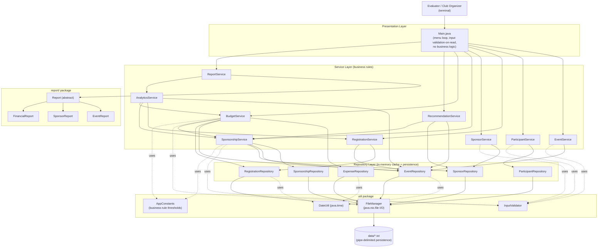
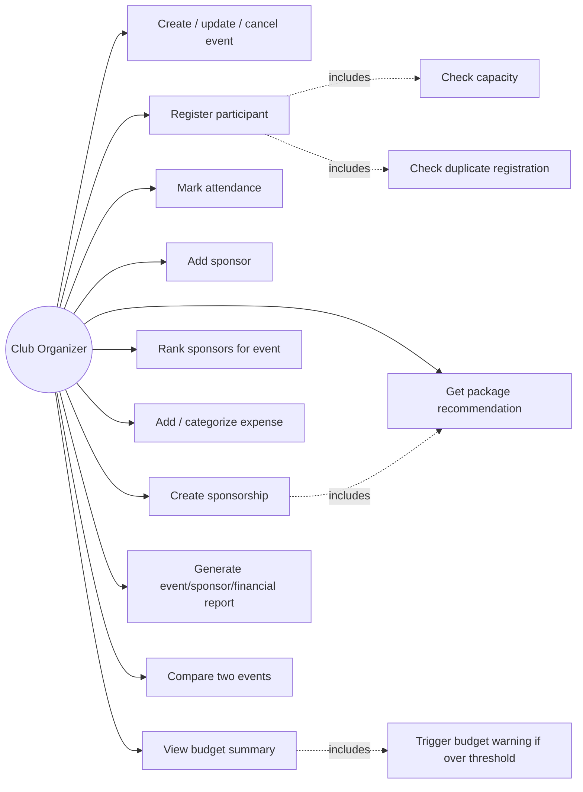
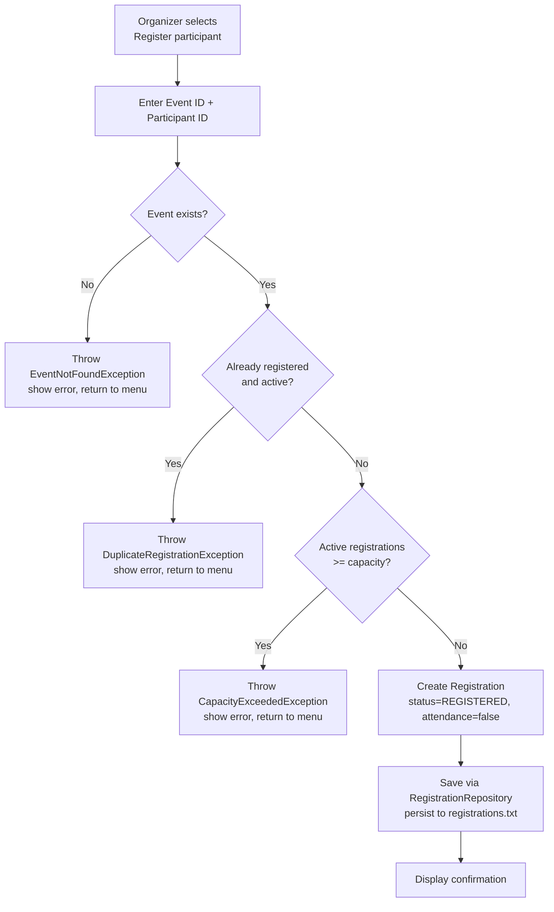
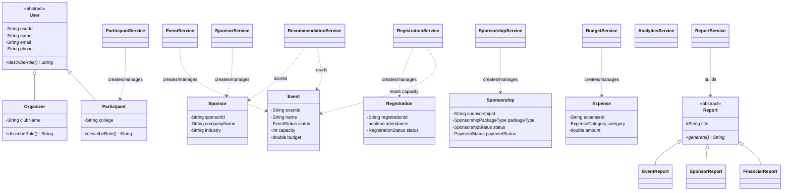
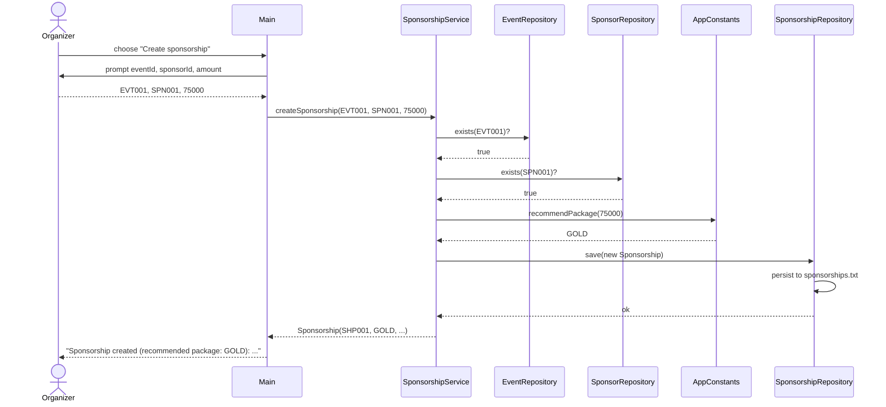

# CampusConnect - Design Diagrams

These diagrams are written in [Mermaid](https://mermaid.js.org/) and
render directly on GitHub. They describe the actual implementation in
`src/campusconnect/` - nothing here is aspirational.

## 1. System Architecture Diagram

## 2. Use Case Diagram

## 3. Process Flow / Workflow Diagram - Registering a Participant

## 4. Class Diagram (core model + service relationships)

## 5. Sequence Diagram - Creating a Sponsorship (with package recommendation)

## Note on persistence design

No ER diagram / database schema is included because this project uses
**file-based persistence** (see `README.md` - Persistence Decision), as
the Programming in Java syllabus it targets does not cover JDBC. Each
entity is instead stored as one pipe-delimited line per record in its own
`data/*.txt` file, loaded into an in-memory `Map` on startup by the
corresponding `*Repository` class and rewritten on every change.
